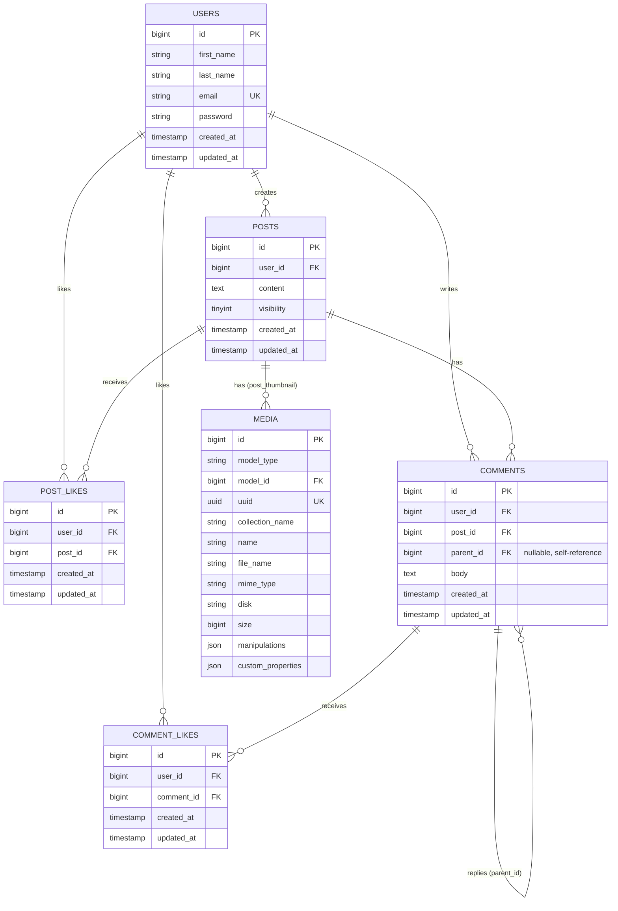

# API Documentation

Base URL: `{APP_URL}/api/app/v1`

Auth: JWT Bearer token (`tymon/jwt-auth`). Send `Authorization: Bearer <token>` on every
route except `login` and `register`. Tokens are obtained from `POST /login`.

All responses share this envelope:

```json
// success
{ "success": true, "data": { ... } }

// error
{ "success": false, "errors": { "error": "message" } }
```

---

## ERD (Entity Relationship Diagram)



Notes:(Di)
- `post_likes` and `comment_likes` enforce uniqueness on `(user_id, post_id)` / `(user_id, comment_id)` — a user can only like a post/comment once.
- `comments.parent_id` is a nullable self-referencing FK used for threaded replies (`Comment::replies()`).
- `media` is a polymorphic table (Spatie MediaLibrary) linked via `model_type` + `model_id`; currently only `Post` (`post_thumbnail` collection) uses it.
For creating Diagrams, you can use [Mermaid Live Editor](https://mermaid-js.github.io/mermaid-live-editor/).

---

## Auth API Endpoints

| Method | Endpoint    | Auth | Body                                                                 | Notes |
|--------|-------------|------|-----------------------------------------------------------------------|-------|
| POST   | `/register` | No   | `first_name`, `last_name`, `email`, `password`, `password_confirmation` | `email` must be unique, `password` min 8 chars |
| POST   | `/login`    | No   | `email`, `password`                                                    | Returns `access_token`, `token_type: Bearer`, `user` |
| POST   | `/logout`   | Yes  | –                                                                       | Invalidates the current JWT |

## Posts API Endpoints

| Method | Endpoint                  | Auth | Body                                          | Notes |
|--------|---------------------------|------|------------------------------------------------|-------|
| GET    | `/posts`                  | Yes  | –                                                | Returns public posts + the caller's own private posts |
| POST   | `/posts`                  | Yes  | `content`, `visibility` (`1`/`0`), `image?` (multipart, optional) | Creates a post; owner-only actions below require the caller to be the post author |
| POST   | `/posts/{postId}/visibility` | Yes | –                                            | Toggles a post between public/private. 403 if caller isn't the owner |
| GET    | `/posts/{postId}/comments`| Yes  | –                                                | Top-level comments + their replies |
| POST   | `/posts/{postId}/comments`| Yes  | `body`                                           | Adds a top-level comment |
| POST   | `/posts/{postId}/like`    | Yes  | –                                                | Toggles the caller's like on the post |
| GET    | `/posts/{postId}/likers`  | Yes  | –                                                | List of users who liked the post |

A private post (`visibility: false`) is only visible in `GET /posts` and its
sub-resources to its own author; other users get a `403` if they try to hit
its comment/like endpoints directly.

### Post response shape

```json
{
  "id": 1,
  "content": "string",
  "thumbnail": { "url": "...", "thumbnail_url": "..." } | null,
  "visibility": true,
  "is_owner": true,
  "user": { "avatar": null, "full_name": "...", "first_name": "...", "last_name": "..." },
  "likes_count": 3,
  "is_liked": false,
  "created_at": "2026-07-01T12:00:00+00:00"
}
```
Here `is_owner` is a temporary attribute. It is `true` if the caller is the post's author , and `is_liked` is `true` if the caller has liked the post.

## Comments API Endpoints

| Method | Endpoint                    | Auth | Body   | Notes |
|--------|------------------------------|------|--------|-------|
| POST   | `/comments/{commentId}/replies` | Yes | `body` | Replies to a top-level comment. Replying to a reply is rejected (422) |
| POST   | `/comments/{commentId}/like` | Yes  | –      | Toggles the caller's like on a comment or reply |
| GET    | `/comments/{commentId}/likers` | Yes | –    | List of users who liked the comment/reply |

### Comment Response shape

```json
{
  "id": 1,
  "body": "string",
  "is_reply": false,
  "parent_id": null,
  "author": { "id": 1, "first_name": "...", "last_name": "..." },
  "likes_count": 2,
  "is_liked": true,
  "replies": [ /* same shape, is_reply: true */ ],
  "created_at": "2026-07-01T12:00:00+00:00"
}
```

---

## Notes on behavior

- **Likes** (posts and comments) are toggle endpoints: calling them once likes,
  calling again un-likes. Each user can like a given post/comment at most once
  (`user_id` + `post_id`/`comment_id` unique constraint).
- **Visibility** is stored as a real boolean in the API (`true` = public,
  `false` = private) via an Eloquent cast, so it's consistent whether a post
  was just created or re-fetched.
- **Replies** are one level deep only — a comment with a `parent_id` cannot
  itself be replied to.
- CORS is open (`*`) on `api/*`, `admin/*`, `app/*`.

